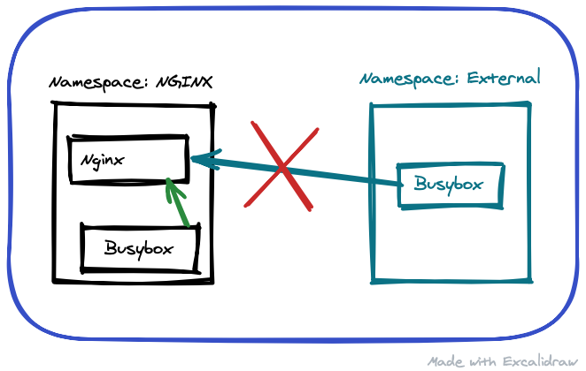

# Kubernetes on GCP

[Kubernetes](https://kubernetes.io) is a widely used system to manage containerised applications.

[GCP](https://www.cloud.google.com) is the computing services platform powered by Google.

This tutorial intends to demonstrate how one can use [Infrastructure as Code (IaC)](https://docs.microsoft.com/en-us/azure/devops/learn/what-is-infrastructure-as-code) to automate the provision of a `Kubernetes` cluster running on `GCP`.

> The presented solutions are intended for learning purposes. Hence, don't treat as production-ready.

Automations:

- [Provision Kubernetes](#provision-kubernetes)
- [Deploying an application](#deploying-an-application)
- [Securing an application](#securing-an-application)
- [Deploying a stateful application](#deploying-a-stateful-application)

> Use the Table of Contents on the top-left corner to explore all options.

## Ansible

[Ansible](https://www.ansible.com) is the tool of choice to implement automation. Ansible is one of the most utilised automation tools in the market and allows the creation of the automation necessary to run the `Kubernetes cluster.

## Requisites

- [Installing Python](https://www.python.org/downloads/)
- [Installing Ansible](https://docs.ansible.com/ansible/latest/installation_guide/intro_installation.html)
- [Ansible Google Cloud Platform Guide](https://docs.ansible.com/ansible/latest/scenario_guides/guide_gce.html)
- [Installing gcloud cli](https://cloud.google.com/sdk/docs/install)
- [Installing gke-gcloud-auth-plugin](https://cloud.google.com/blog/products/containers-kubernetes/kubectl-auth-changes-in-gke)
- [google-auth Python package](https://pypi.org/project/google-auth/)
- [requests Python package](https://pypi.org/project/requests/)
- [kubernetes Python package](https://pypi.org/project/kubernetes/)
- [Ansible Kubernetes Module requirements](https://docs.ansible.com/ansible/latest/collections/kubernetes/core/k8s_module.html#requirements)

## Environment

The local environment used to test the scripts had the following software:

| Software | Version |
|--|--|
| macOS Ventura | 13.2.1 |
| ansible-core | 2.14.13 |
| Python | 3.9.6 |
| Python lib `requests` | 2.28.2 |
| Python lib `google-auth` | 2.16.2 |
| Python lib `kubernetes` | 26.1.0 |
| gcloud sdk | 422.0.0 |

## Ansible Directory Layout

```bash
.
├── LICENSE                        # license file
├── README.md                      # main documentation file
└── ansible                        # Ansible top-level folder
    ├── ansible.cfg                # Ansible config file
    ├── create-k8s.yml             # Ansible playbook to provision env
    ├── deploy-app-k8s.yml         # Ansible playbook to deploy a Nginx web-server
    ├── destroy-k8s.yml            # Ansible playbook to destroy env
    ├── undeploy-app-k8s.yml       # Ansible playbook to remove the Nginx web-server
    ├── inventory             
    │   └── gcp.yml                # Ansible inventory file
    └── roles
        ├── destroy_k8s            # Ansible role to remove k8s cluster        
        │   └── tasks
        │       └── main.yml
        ├── destroy_k8s_deployment # Ansible role to remove the Nginx web-server
        │       └── tasks
        │           └── main.yml
        ├── destroy_k8s_policies   # Ansible role to remove the k8s network policies
        │       └── tasks
        │           └── main.yml
        ├── destroy_network        # Ansible role to remove VPC
        │   └── tasks
        │       └── main.yml
        ├── k8s                    # Ansible role to create k8s cluster
        │   └── tasks
        │       └── main.yml
        ├── k8s-deployment         # Ansible role to deploy a Nginx web-server
        │   ├── tasks
        │   │   └── main.yml
        │   └── vars
        │       └── main.yml
        ├── k8s-policies           # Ansible role to configure k8s network policies
        │   └── tasks
        │       └── main.yml
        ├── k8s-statefulset        # Ansible role to deploy a Kafka cluster
        │   └── tasks
        │       └── main.yml
        └── network                # Ansible role to create VPC
            └── tasks
                └── main.yml
```

## How to use this repository

Create a `yaml` file in the `ansible/inventory` folder to allow Ansible to interact with your `GCP` environment.

Here is a sample file:

```yaml
all:
  vars:
    # use this section to enter GCP related information
    zone: europe-west2-c
    region: europe-west2
    project_id: <gcp-project-id>
    gcloud_sa_path: "~/gcp-credentials/service-account.json"
    credentials_file: "{{ lookup('env','HOME') }}/{{ gcloud_sa_path }}"
    gcloud_service_account: service-account@project-id.iam.gserviceaccount.com

    # use the section below to enter k8s cluster related information
    cluster_name: <name for your k8s cluster>
    initial_node_count: 1
    disk_size_gb: 100
    disk_type: pd-ssd
    machine_type: n1-standard-2

    # use the section below to enter k8s namespaces to manage
    # this namespace is used in the Deploying an Application section
    namespace: nginx
```

Refer to Ansible documentation on [How to build your inventory](https://docs.ansible.com/ansible/latest/user_guide/intro_inventory.html) for more information.

## Provision Kubernetes

Execute the following command to provision the `Kubernetes` cluster:

```bash
ansible-playbook ansible/create-k8s.yml -i ansible/inventory/<your-inventory-filename>
```

**Output:**

```text
PLAY [create infra] ****************************************************************

TASK [network : create GCP network] ************************************************
changed: [localhost]

TASK [k8s : create k8s cluster] ****************************************************
changed: [localhost]

TASK [k8s : create k8s node pool] **************************************************
changed: [localhost]

PLAY RECAP *************************************************************************
localhost: ok=3  changed=3  unreachable=0  failed=0  skipped=0  rescued=0  ignored=0 
```

### Connecting to the Kubernetes cluster

Use the [gcloud](https://cloud.google.com/sdk/gcloud) command-line tool to connect to the Kubernetes cluster:

```bash
gcloud container clusters get-credentials <cluster_name> --zone <zone> --project <project_id>
```

_Note:_ replace the variables with the values used in the inventory file. Also, it's possible to retrieve this command from the `Kubernetes Cluster` page on `GCP` console.

**Output:**

```text
Fetching cluster endpoint and auth data.
kubeconfig entry generated for devops-platform.
```

### Using the Kubernetes cluster

After connecting to the cluster use the [kubectl](https://kubernetes.io/docs/reference/kubectl/overview/) command-line tool to control the cluster.

```text
kubectl get nodes
```

**Output:**

```text
NAME                                                STATUS   ROLES    AGE   VERSION
gke-<cluster_name>-node-pool-e058a106-zn2b          Ready    <none>   10m   v1.18.12-gke.1210
```

## Deploying an application

The role `k8s-deployment` contains an example of how deploy a `NGINX` container in the `Kubernetes` cluster.

The role will create:

- [Kubernetes Namespace](https://kubernetes.io/docs/concepts/overview/working-with-objects/namespaces/)
- [Kubernetes Pod](https://kubernetes.io/docs/concepts/workloads/pods/)

Investigating the role `directory structure`, we noticed that there is a `vars` folder. We Set variables in roles to ensure a value is used in that role, and is not overridden by inventory variables. Refer to [Ansible Using Variables](https://docs.ansible.com/ansible/latest/user_guide/playbooks_variables.html#variable-examples) documentation for more details.

Execute the following command to deploy the `Nginx` web-server:

```bash
ansible-playbook ansible/deploy-app-k8s.yml -i ansible/inventory/<your-inventory-filename>
```

**Output:**

```text
PLAY [deploy application] **********************************************************

TASK [k8s-deployment : Create a k8s namespace] *************************************
changed: [localhost]

TASK [k8s-deployment : Create a k8s service to expose nginx] ***********************
changed: [localhost]

PLAY RECAP *************************************************************************
localhost: ok=2  changed=2  unreachable=0  failed=0  skipped=0  rescued=0  ignored=0 
```

### Accessing the Nginx

Execute the following commands and then access the `Nginx` using this [URL](http://127.0.0.1:8080).

```bash
export POD_NAME=$(kubectl get pods --namespace nginx -l "app=nginx" -o jsonpath="{.items[0].metadata.name}")
kubectl --namespace nginx port-forward $POD_NAME 8080:80 
```

## Securing an application



Now that we have a running cluster and a working application, the next step is to secure the traffic flow to our Nginx pod. We will do that using [Kubernetes Network Policies](https://kubernetes.io/docs/concepts/services-networking/network-policies/#default-deny-all-ingress-traffic).

As we can see in the diagram above, we will **allow** communication from other pods in the same namespace as the Nginx pod while **denying** connection from the **external** namespace.

The role `k8s-policies` contains the manifest files to enable this configuration. It will create the **external** namespace and deploy a couple of [busybox](https://busybox.net) containers to help us demonstrate the policies.

Execute the following command to deploy the `Nginx` web-server:

```bash
ansible-playbook ansible/secure-app-k8s.yml -i ansible/inventory/<your-inventory-filename>
```

**Output:**

```text
PLAY [deploy application] **********************************************************************

TASK [k8s-policies : Create busybox pod on Nginx namespace] ************************************
ok: [localhost]

TASK [k8s-policies : Create external namespace] ************************************************
ok: [localhost]

TASK [k8s-policies : Create busybox pod on External namespace] *********************************
ok: [localhost]

TASK [k8s-policies : Create network policy to deny ingress] ************************************************************************************************
changed: [localhost]

PLAY RECAP *************************************************************************************
localhost: ok=4    changed=1    unreachable=0    failed=0    skipped=0    rescued=0    ignored=0
```

### Testing communication between the pods

Retrieve the `ip address` of the `nginx` pod:

```bash
kubectl get pods --namespace nginx -l "app=nginx" -o jsonpath="{.items[0].status.podIP}"
```

#### From a pod in the Nginx namespace

Use the `busybox` container to connect to the `nginx` pod:

```bash
kubectl -n nginx exec busybox -- wget --spider 10.40.1.10
```

**Output:**

```text
Connecting to 10.40.1.10 (10.40.1.10:80)
remote file exists
```

#### From a pod in the External namespace

```bash
kubectl -n external exec busybox -- wget --spider 10.40.1.13
```

**Output:**

```text
Connecting to 10.40.1.13 (10.40.1.13:80)
wget: can't connect to remote host (10.40.1.13): Connection timed out
command terminated with exit code 1
```

> This is the expected behaviour because our goal is to only allow access from pods in the nginx namespace.

Execute the following playbook to remove the `Network Policy` and re-run the `wget` command from the `external` namespace and see what happens!

```bash
ansible-playbook ansible/unsecure-app-k8s.yml -i ansible/inventory/<your-inventory-filename>
```

## Deploying a stateful application

The role `k8s-statefulset` contains an example of how to deploy a [Kafka](https://kafka.apache.org) broker in the `Kubernetes` cluster.

The role will create:

- [Kubernetes Namespace](https://kubernetes.io/docs/concepts/overview/working-with-objects/namespaces/)
- [Kubernetes Services](https://kubernetes.io/docs/concepts/services-networking/service/)
- [Kubernetes StatefulSet](https://kubernetes.io/docs/concepts/workloads/controllers/statefulset/)
- [Kubernetes Pod](https://kubernetes.io/docs/concepts/workloads/pods/)

Execute the following command to deploy the `Kafka` cluster:

```bash
ansible-playbook ansible/deploy-statefulset-k8s.yml -i ansible/inventory/gcp.yml
```

**Output:**

PLAY [deploy statefulset application] **********************************************************

TASK [k8s-statefulset : create namespace zookeeper] ********************************************
changed: [localhost]

TASK [k8s-statefulset : create zookeeper-headless service] *************************************
changed: [localhost]

TASK [k8s-statefulset : create zookeeper service] **********************************************
changed: [localhost]

TASK [k8s-statefulset : deploy apache zookeeper] ***********************************************
changed: [localhost]

TASK [k8s-statefulset : wait for zookeeper pods to be running] ************************************************************************************************
ok: [localhost]

TASK [k8s-statefulset : create namespace kafka] ************************************************
changed: [localhost]

TASK [k8s-statefulset : create kafka service for Broker] ***************************************
changed: [localhost]

TASK [k8s-statefulset : deploy apache kafka Broker 1] ******************************************
changed: [localhost]

PLAY RECAP *************************************************************************************
localhost: ok=8    changed=7    unreachable=0    failed=0    skipped=0    rescued=0    ignored=0

### Testing Kafka

Connect to the `broker` pod, create, and list a `topic`.

```bash
kubectl exec -it -n kafka kafka-broker-0 -- bash
/opt/bitnami/kafka/bin/kafka-topics.sh --zookeeper zookeeper-headless.zookeeper:2181 --create --topic test-topic --partitions 1 --replication-factor 1
/opt/bitnami/kafka/bin/kafka-topics.sh --bootstrap-server localhost:9092 --list
```

## Cleaning up

Execute the following command to destroy the `Kubernetes` cluster:

`ansible-playbook ansible/destroy-k8s.yml -i ansible/inventory/<your-inventory-filename>`

**Output:**

```text
PLAY [destroy infra] *********************************************************************

TASK [destroy_k8s : destroy k8s cluster] *************************************************
changed: [localhost]

TASK [destroy_network : destroy GCP network] *********************************************
changed: [localhost]

PLAY RECAP *******************************************************************************
localhost: ok=2   changed=2   unreachable=0   failed=0   skipped=0   rescued=0   ignored=0 
```

## References

- [Ansible Documentation](https://docs.ansible.com) for more information on how to expand your Ansible knowledge and usage.
- [Ansible Google Cloud Collection](https://docs.ansible.com/ansible/latest/collections/google/cloud/) for more information on available modules.
- [Ansible Kubernetes module](https://docs.ansible.com/ansible/latest/collections/kubernetes/core/k8s_module.html#ansible-collections-kubernetes-core-k8s-module) for more information on `Kubernetes` automation.
- [Ansible Roles](https://docs.ansible.com/ansible/latest/user_guide/playbooks_reuse_roles.html#roles) for `roles` specific documentation.
